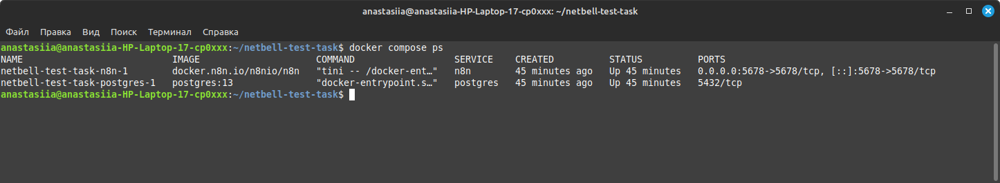
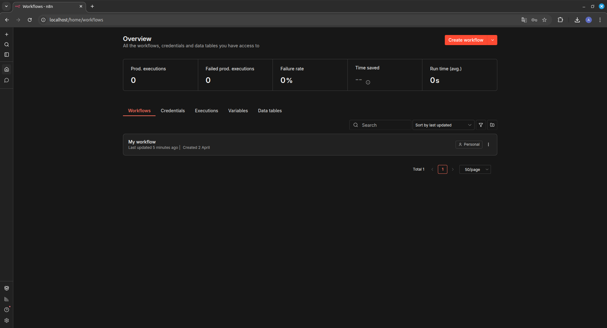
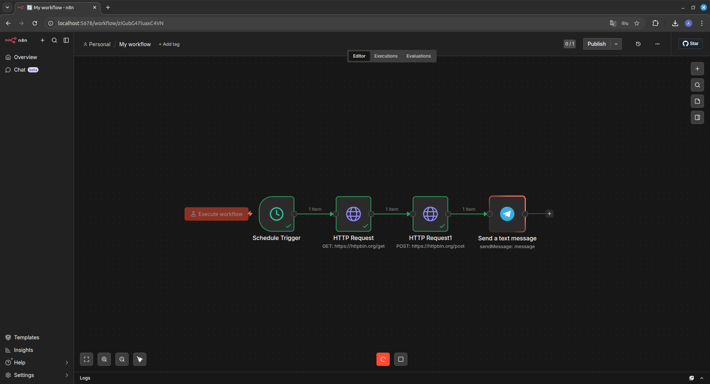
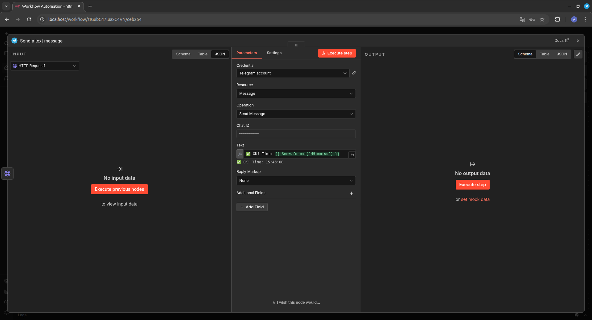
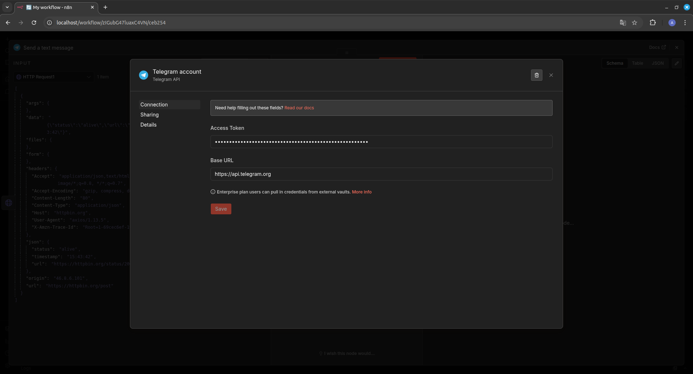
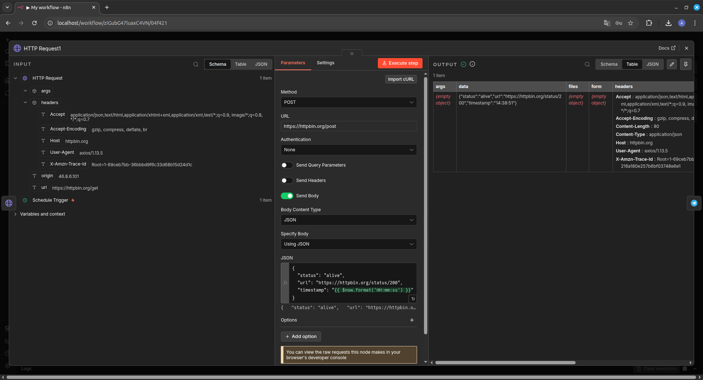

# Тестовое задание: AI Automation / DevOps Engineer

## ✅ Что сделано

- [x] n8n + PostgreSQL через Docker Compose
- [x] Nginx reverse proxy (http://localhost → :5678)
- [x] Воркфлоу: проверка сайта каждые 30 сек
- [x] Telegram-узел настроен (требует прокси в РФ)
- [x] Альтернативная отправка на https://httpbin.org/post

## 🚀 Запуск

```bash
# 1. Клонировать
git clone https://github.com/anastasiiaglushakova/netbell-test-task
cd netbell-test-task

# 2. Изменить пароль в docker-compose.yml
# Change!!!

# 3. Запустить
docker compose up -d

# 4. Открыть
http://localhost
```

## 📁 Структура

```
├── docker-compose.yml
├── nginx/n8n.conf
├── workflow/monitor-site.json
├── screenshots/
└── README.md
```

## ⚠️ Telegram в РФ

Узел добавлен (требуется настройка credentials), но **не работает без прокси** (API заблокирован).

**Что проверено:**
- ✅ Узел добавлен в воркфлоу
- ✅ Credentials созданы (токен скрыт)
- ✅ Данные доходят до узла (предыдущие шаги зелёные)
- ✅ Выражения работают (превью показывает корректное время)

**Что требуется для работы:**
1.  HTTP/HTTPS прокси в `docker-compose.yml`
2.  Валидный Access Token от @BotFather
3.  Валидный Chat ID от @userinfobot
```

Логика отправки проверена на `https://httpbin.org/post`.

## 📸 Скриншоты








---